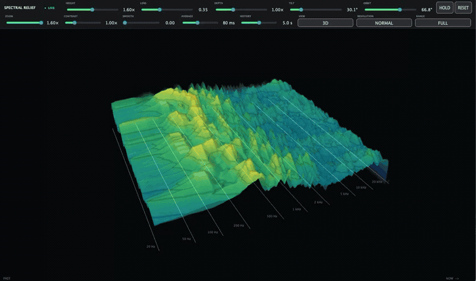

# Spectral Relief

Spectral Relief is a **free, open-source VST3 audio spectrogram plugin** for
macOS. It turns the audio passing through an Ableton Live track into a detailed
2D heatmap or a controllable 3D spectral surface without changing the audio or
adding plug-in latency.

Developed by **Nijat Burjiyev**.

> **Project status:** early public alpha. Spectral Relief is tested on Apple
> Silicon and Ableton Live 12. Feedback and reproducible bug reports are
> welcome.

## Demo



## Highlights

- Transparent VST3 audio effect: analysis never modifies track audio.
- Logarithmic frequency axis aligned with human pitch perception.
- Calibrated, unweighted dBFS levels with no hidden loudness compensation.
- Normal, High, and Ultra analysis modes with up to an 8192-point FFT and
  1024 logarithmic bands.
- Full, Low, Mid, and High frequency-range views.
- Orthographic 2D heatmap and camera-controlled 3D relief modes.
- Fixed-size audio queues, bounded analyzer memory, and a circular GPU history
  texture designed for real-time use.
- Independent perceptual power averaging and display smoothing controls.

## Controls

| Control | Purpose |
| --- | --- |
| Height | Changes spectral mountain elevation. |
| Lens | Applies a radial fisheye projection around a stable optical centre. |
| Depth | Expands or compresses the visible history axis. |
| Tilt / Orbit | Positions the 3D camera, including a true top-down view. |
| Zoom | Changes framing without changing analysis data. |
| Contrast | Separates quiet and loud colour detail without changing geometry. |
| Smooth | Applies display-only temporal smoothing. Zero preserves every analyzed row. |
| Average | Integrates each band's linear power from Off to 1000 ms without mixing frequencies. |
| History | Selects 2–8 seconds of visible history. |
| View | Switches between 3D relief and an exact 2D heatmap. |
| Resolution | Selects Normal, High, or Ultra analysis. |
| Range | Selects Full, Low, Mid, or High frequency coverage. |
| Hold / Reset | Freezes the display or clears its visual and averaging history. |

Every control affects visualization only.

## Requirements

- macOS on Apple Silicon
- Apple Command Line Tools
- CMake 3.25 or newer
- Git
- A VST3-compatible host such as Ableton Live

Install CMake with Homebrew if needed:

```bash
brew install cmake
```

## Build and test

JUCE 8.0.15 is fetched automatically at its pinned commit.

```bash
cmake -S . -B build-release \
  -DCMAKE_BUILD_TYPE=Release \
  -DCMAKE_OSX_ARCHITECTURES=arm64
cmake --build build-release --target SpectralReliefTests SpectralRelief_VST3 -j4
ctest --test-dir build-release --output-on-failure
```

The resulting plug-in bundle is located at:

```text
build-release/SpectralRelief_artefacts/Release/VST3/Spectral Relief.vst3
```

## Install in Ableton Live

1. Quit Ableton Live before replacing an existing build.
2. Copy `Spectral Relief.vst3` to
   `~/Library/Audio/Plug-Ins/VST3/`.
3. Open Live and enable VST3 system folders under Settings → Plug-Ins.
4. Rescan plug-ins and insert **Spectral Relief** after an instrument or audio
   clip.

For a thorough manual check, follow the
[Ableton smoke test](docs/testing/ableton-smoke-test.md).

## Architecture

The audio callback passes samples through unchanged and copies a bounded mono
analysis feed into a preallocated 256 KiB single-producer/single-consumer
queue. A low-priority worker owns three preallocated FFT analyzers and fixed
1024-band averaging state. It publishes fixed-capacity frames to an eight-slot
lock-free queue. The renderer retains one active mesh and one 512 KiB circular
half-float history texture.

Queue overflow drops visualization samples instead of blocking the audio
thread. Averaging operates on calibrated linear power before display
normalization; smoothing is a separate display-only stage.

## Inspiration and acknowledgements

The visual language and several performance principles were inspired by
[Chrome Music Lab's Spectrogram](https://github.com/googlecreativelab/chrome-music-lab/tree/master/spectrogram),
developed by Google Creative Lab. In particular, its GPU-displaced surface,
rolling texture, and bright spectral ridges helped shape the direction of this
project.

Spectral Relief is an original C++/JUCE/OpenGL implementation. It does not
include or port Chrome Music Lab source code, is not an official Google
product, and is not affiliated with or endorsed by Google.

See [THIRD_PARTY_NOTICES.md](THIRD_PARTY_NOTICES.md) for framework and reference
licenses.

## Contributing

Bug reports and focused pull requests are welcome. Read
[CONTRIBUTING.md](CONTRIBUTING.md) before submitting a change. Security issues
should follow [SECURITY.md](SECURITY.md).

## License

Copyright © 2026 Nijat Burjiyev.

Spectral Relief is licensed under the
[GNU Affero General Public License v3.0 only](LICENSE) (`AGPL-3.0-only`). This
license is used because the project links against JUCE under JUCE's AGPLv3
open-source option. A commercial JUCE license would be required for a
closed-source distribution.

Apple has deprecated OpenGL. It remains the renderer for this early version
because JUCE provides a compact cross-host integration; the analyzer and queue
boundaries are intentionally independent of the rendering backend.
